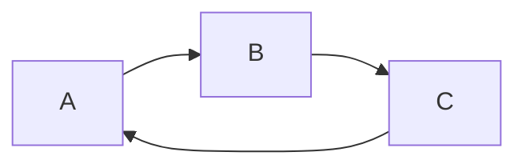
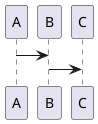
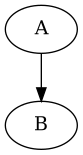
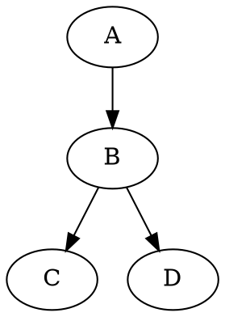

# 这是一级标题
## 这是二级标题
### 这是三级标题
#### 这是四级标题
##### 这是五级标题
###### 这是六级标题

# 这个标题拥有 1 个 id {#my_id}
# 这个标题有 2 个 classes {.class1 .class2}

*这会是 斜体 的文字*
_这会是 斜体 的文字_

**这会是 粗体 的文字**
__这会是 粗体 的文字__

_你也 **组合** 这些符号_

~~这个文字将会被横线删除~~

**_This text is extremely important_**

+ aaaa
+ BBBBB
+ ddddd
- DDDD
- EEEE

* Item 1
* Item 2
  * Item 2a
  * Item 2b


1. Item 1
2. Item 2
3. Item 3
4. Item 3a
5. Item 3b


[GitHub](http://github.com)

正如 Kanye West 所说：

> We're living the future so
the present is our past.
77d1cd475d43fbf2da2ca023807fca1e
> dddddddfafaefafa

如下，三个或者更多的

---

连字符

***

星号

___

下划线

我觉得你应该在这里使用
`<addr>` 才对。


```ruby
require 'redcarpet'
markdown = Redcarpet.new("Hello World!")
puts markdown.to_html
```


```javascript {.class1 .class}
function add(x, y) {
  return x + y
}
```

```javascript {.line-numbers highlight=[1,3]}
function add(x, y) {
  return x + y
}
```

- [x] @mentions, #refs, [links](), **formatting**, and <del>tags</del> supported
- [x] list syntax required (any unordered or ordered list supported)
- [ ] this is a complete item
- [ ] this is an incomplete item

First Header | Second Header
------------ | -------------
Content from cell 1 | Content from cell 2
Content in the first column | Content in the second column

|  a | b |
|--- |---|
|> |1|
|d|d|


:smile:
:fa-car:

30^th^

H~2~O

Content [^1]

[^1]: Hi! This is a footnote


==marked==


添加 {++ ++}
删除 {-- --}
替换 {~~ ~> ~~}
注释 {>> <<}
高亮 {== ==}{>> <<}

aaaa $f(x) = sin(x) + 12$
bbb \(f(x) = sin(x) + 12\)

ccc $$f(x) = sin(x) + 12$$
ddd \[f(x) = sin(x) + 12\]
eee ```math f(x) = sin(x) + 12


```flow
st=>start: Start:>http://www.google.com[blank]
e=>end: End:>http://www.google.com
op1=>operation: My Operation
sub1=>subroutine: My Subroutine
cond=>condition: Yes
or No?:>http://google.com
io=>inputoutput: catch something...

st->op1->cond
cond(yes)->io->e
cond(no)->sub1(right)->op1
```
---

```sequence{theme="hand"}
Andrew->China: Says Hello
Note right of China: China thinks\nabout it
China-->Andrew: How are you ?
Andrew->>China: I am good thinks
```

---


---

```puml
A -> B
```




---

```wavedrom
{
  signal:[
    {
      name:'clk', wave:'p..Pp..P'
    },
    [
      'Master',
      [
        'ctrl',
        {
          name:'write', wave:'01.0....'
        },
        {
          name:'write', wave:'0...1..0'
        }
      ],
      {
        name:'addr', wave:'x3.x4..x', data:'A1 A2'
      },
      {
        name:'wdata', wave:'x3.x....', data:'D1'
      },
    ],
    {

    },
    [
      'Slave',
      [
        'ctrl',
        {
          name:'ack', wave:'x01x0.1x'
        },
      ],
      {
        name:'rdata', wave:'x....4x', data:'Q2'
      },
    ]

  ]

}
```
---




---

```vega-lite
{
  "$schema":"https://vega.github.io/schema/vega-lite/va.json",
  "description":"A simple bar chart with embedded data",
  "data":{
    "values":[
      {"a":"A", "b":20},
      {"a":"B", "b":55},
      {"a":"C", "b":43}
    ]
  },
  "mark":"bar",
  "encoding":{
    "x":{"field":"a", "type":"ordinal"},
    "y":{"field":"b", "type":"quantitative"}
  },
  "width":500,
  "height":400
}
```

---


@import "./data.json" {as="vega"}
@import "./data.json" {as="vega-lite"}

---
```ditaa {cmd=true args=["-E"]}
  +--------+   +-------+    +-------+
  |        | --+ ditaa +--> |       |
  |  Text  |   +-------+    |diagram|
  |Document|   |!magic!|    |       |
  |     {d}|   |       |    |       |
  +---+----+   +-------+    +-------+
      :                         ^
      |       Lots of work      |
      +-------------------------+
  ```
